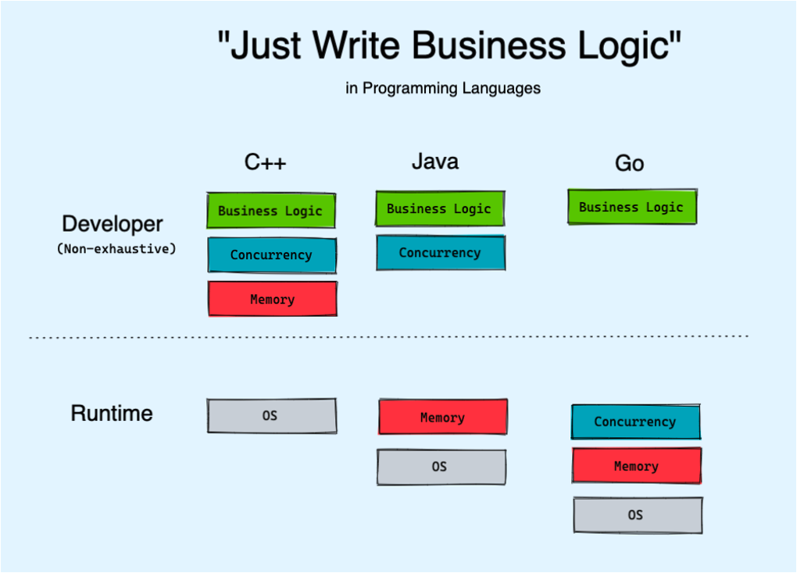
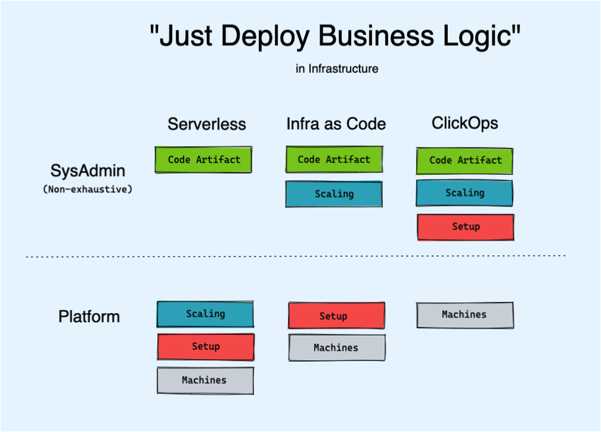
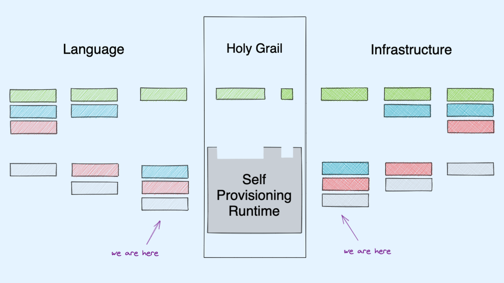

# Infrastructure from Code

velog 링크

- https://velog.io/@mele/Infrastructure-FROM-Code

### 목차

- 프로그래밍 언어의 발전 과정
  
- 인프라 구성의 발전 과정
  
- 궁극적인 최종 단계
  
- ifc 소개
  - 수 많은 디테일들까지
- 네 가지 접근 방식 소개
  - 프로그래밍 언어
  - SDK
  - 주석
  - SDK + 주석
- 한 가지 방식의 실습
  - 아마 주석 방식 할 듯?
  - (여유 되면 네 가지 전부 다..)
- ifc의 한계
- 요약
